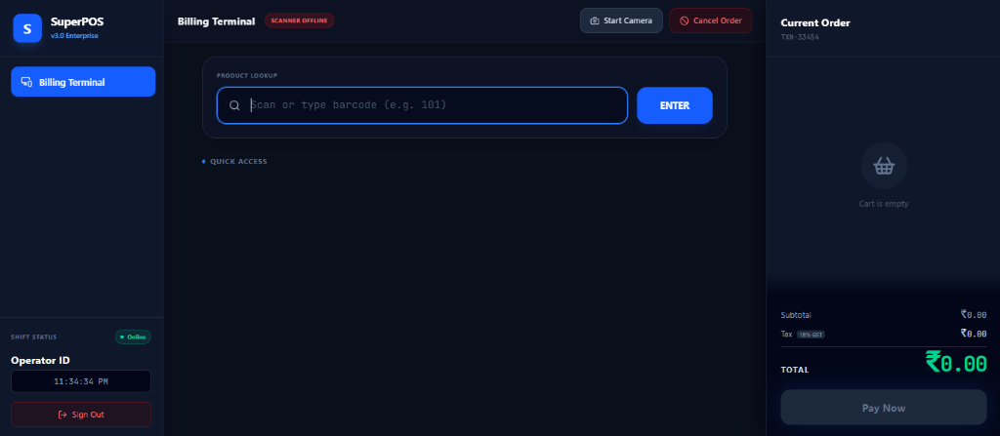

# SuperPOS Pro 🛒

SuperPOS Pro is a modern, high-performance Point of Sale (POS) and Retail Management System built for the web. Designed with a sleek user interface and robust backend architecture, it provides an end-to-end solution for inventory management, dynamic sales processing, and financial tracking.

## 🚀 Live Demo
https://smarttrolleyapp.vercel.app

## ✨ Key Features

- **Dynamic POS Terminal:** Lightning-fast checkout process with barcode scanning support and dynamic bill generation.
- **Secure Authentication:** Role-based access control (Admin vs. Worker) with fully encrypted passwords using `bcrypt`.
- **UPI QR Code Integration:** Automatically generates dynamic UPI QR codes for seamless cashless payments based on the total bill amount.
- **Printable Receipts:** Beautifully formatted receipts ready for thermal or standard printing.
- **Inventory Management:** Full CRUD capabilities for products, including real-time stock tracking and cost-price analysis.
- **Finance Dashboard:** Comprehensive analytics tracking total revenue, gross profit, and tax collection.

## 🛠️ Tech Stack

- **Frontend:** Next.js 14, React, TailwindCSS, Framer Motion
- **Backend:** Next.js Server Actions
- **Database:** PostgreSQL (Hosted on Supabase)
- **ORM:** Prisma
- **Authentication:** Custom JWT-style cookie sessions with bcrypt encryption
- **Icons & UI:** Lucide React, Custom CSS Tokens

## 📸 Screenshots

| Login Screen | POS Terminal |
| --- | --- |
|  |  |

## ⚙️ Local Development Setup

If you want to run this project locally on your machine:

1. **Clone the repository:**
   ```bash
   git clone https://github.com/developeradhi/smarttrolleyapp.git
   cd smarttrolleyapp
   ```

2. **Install dependencies:**
   ```bash
   npm install
   ```

3. **Set up Environment Variables:**
   Create a `.env` file in the root directory and add your Supabase connection strings:
   ```env
   DATABASE_URL="your-supabase-connection-string"
   DIRECT_URL="your-supabase-connection-string"
   ```

4. **Run Database Migrations & Seed:**
   ```bash
   npx prisma db push
   npx prisma db seed
   ```

5. **Start the Development Server:**
   ```bash
   npm run dev
   ```

## 👨‍💻 Author

**Adhi**
- GitHub: [@developeradhi](https://github.com/developeradhi)
- Portfolio: *(Add your portfolio link here)*
